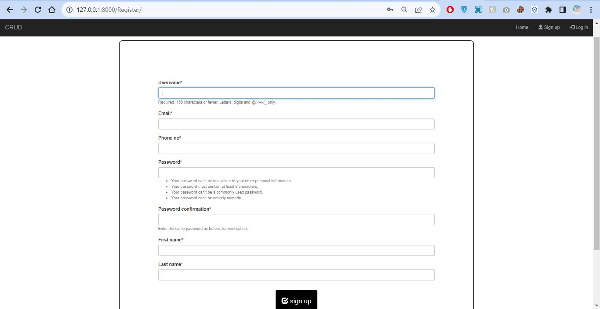
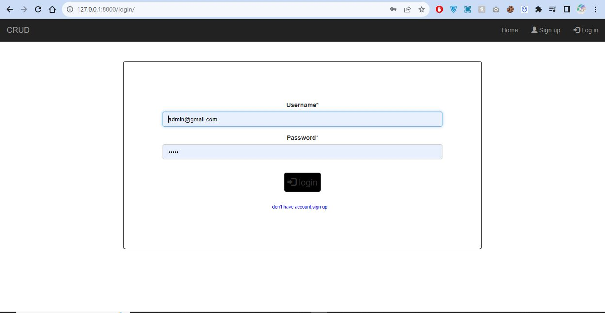
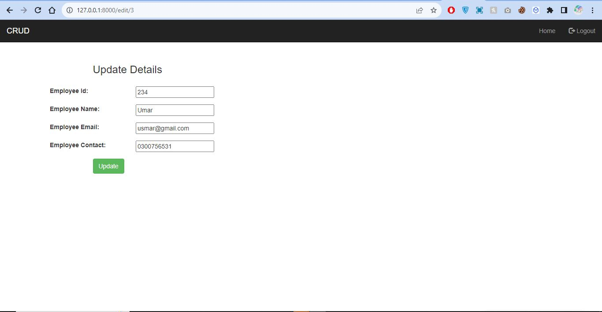

# Django Employee Management System

## Overview

Welcome to the Django Employee Management System! This web application provides a simple yet effective solution for managing employee data. Users can sign up, log in, and perform various CRUD (Create, Read, Update, Delete) operations on employee records.

## Features

- **User Authentication:**
  - Sign up with validation.
  - Log in securely.

- **Employee Management:**
  - Add new employee data.
  - View a list of employees.
  - Edit existing employee data.
  - Delete employee records.

## Technologies Used

- Django
- HTML
- CSS
- Bootstrap
- SQLite (or your preferred database)

## Installation
1. Clone the repository:

   ```bash
   git clone https://github.com/talatghafoor/Django_CRUD_App_With_Loin_Register.git

   cd your-repo

   pip install -r requirements.txt

   python manage.py migrate

   python manage.py runserver


## SNAPS









